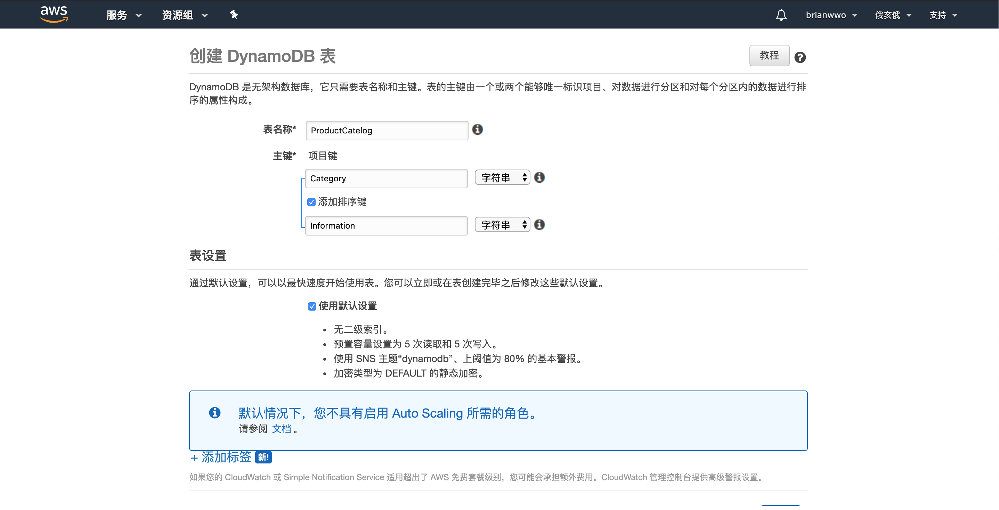
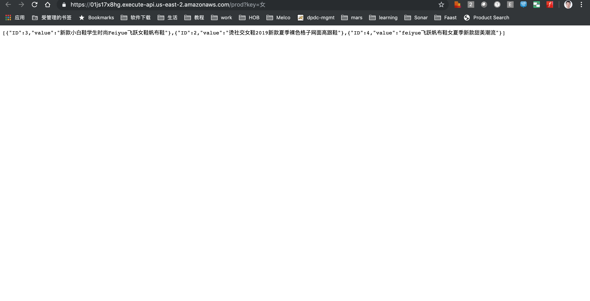

# 项目说明
根据用户在搜索框中打出的提示实时的从后端服务器查找相关的查询结果并显示在下拉列表中，以方便用户选择。

[Demo](http://demo-product-search.s3-website.us-east-2.amazonaws.com)

# 架构说明

1. 用户通过浏览器访问静态web资源
2. js调用ajax访问动态资源
   - API Gateway通过反向代理把请求提交到Lambda，并向用户提供api借口
   - Lambda通过从上游传输过来的请求数据调用DynamoDB拿到结果并返回给上游

#### 可改进空间
1. 可在S3上游搭建Cloud Front以作为CDN对静态资源作为缓存，提高非本程序Region的可访问性，减少延迟。
2. 可在Lambda Function层添加错误处理，当重试次数达到预设值后发送消息到相关人员或者集成相关错误处理系统。
3. 可在增加Dynamodb DAX缓存层，以减少用户对数据库的直接访问。
4. 增加域名并开启https (Route 53)。
5. 可按照需求增加是否需要用户验证，AWS Cognito。
6. 利用AWS Codedeploy自动部署静态资源和Lambda Function。

# 操作步骤
1. 搭建DynamoDB
   1. 
   创建ProductCatelog表{Category (分区键), Information (排序键)}
2. 搭建Lamda Function
   1. 新建Lamda访问角色，选择AWSLambdaBasicExecutionRole为托管策略，选择Query作为内联策略。
   
   2. 新建Lamda Function，选择上述角色，待Function写完之后保存并发布。
3. API Gateway
   1. 选择边缘优化以增强api可访问性。
   
   2. 新建Get方法，选择已创建的Lambda Function，勾选Lambda代理集成。
   3. 在“操作”中选择启用CORS以支持跨域请求。
   4. 测试API Gateway是否可访问
   
4. S3
   1. 新建S3 bucket,不勾选阻止公共访问
   
   2. 利用策略生成器生成所有公共访问允许的策略并粘贴进存储桶策略
   
   3. 上传静态web文件到存储桶
   4. 打开静态托管
   
5. 测试

